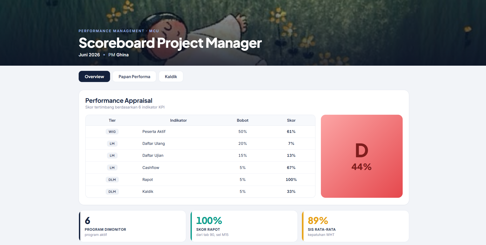
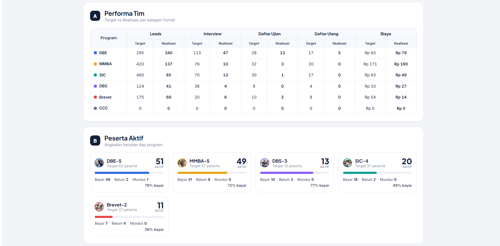
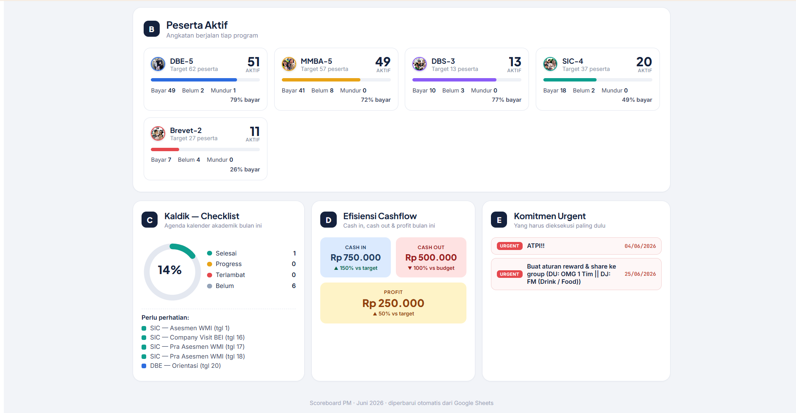
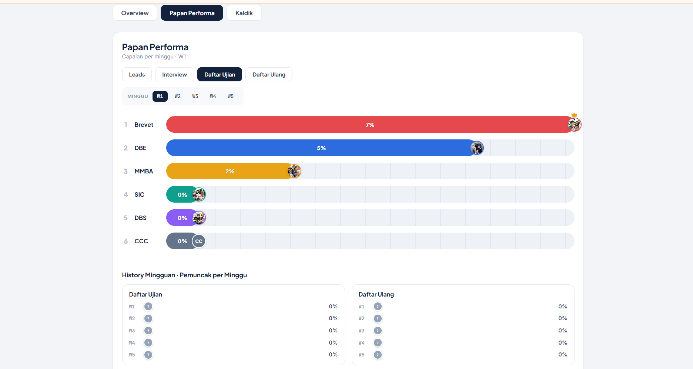
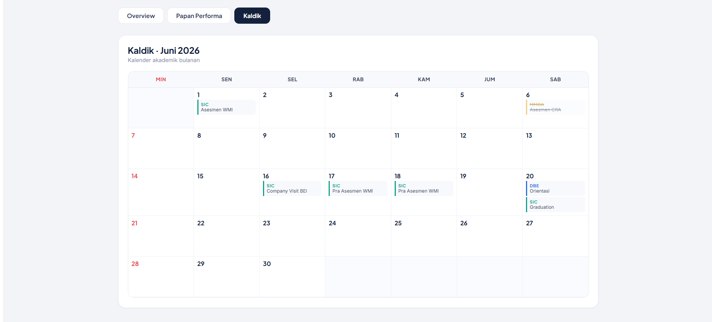

# MCU Hub — Project Management Dashboard


An internal operations dashboard that centralizes performance monitoring across six education programs, helping project managers and executives make faster, data-driven decisions.

> ⚠️ This project contains anonymized data and screenshots to protect confidential business information.
---

## 📌 Background

As the organization expanded to six education programs, monitoring operational performance became increasingly difficult.

Project Managers had to review multiple Google Sheets individually to monitor participant progress, marketing performance, cashflow, and academic activities. Each weekly review required manually checking data across different spreadsheets before any discussion or decision could be made.

The existing workflow was time-consuming, difficult to maintain, and made cross-program comparisons inefficient.

---

## 💡 Solution

I designed and developed a centralized dashboard that consolidates operational data into a single interface.

Instead of opening multiple spreadsheets, Project Managers and executives can monitor key operational indicators from one dashboard.

The dashboard automatically retrieves data from standardized Google Sheets, reducing manual reporting while improving visibility across all programs.

---

## ✨ Key Features

### 📊 Executive Overview

Monitor key operational metrics, including:

- Team performance indicators
- Monthly participant summary
- Active participants
- Payment status
- Cashflow progress
- Academic calendar checklist
- PM commitments and priorities

---

### 🏆 Performance Board

Compare weekly performance across six education programs.

This view helps management identify:

- Best-performing programs
- Operational bottlenecks
- Programs requiring immediate attention

---

### 📅 Academic Calendar

Monthly calendar view displaying operational activities and important program milestones.

---

## 👩‍💻 My Role

I was responsible for the entire project lifecycle:

- Identified operational bottlenecks
- Designed dashboard structure and user flow
- Planned data integration
- Built the dashboard using React
- Connected live Google Sheets data
- Deployed the application using Vercel
- Tested and refined the dashboard based on operational needs
- Standardized operational workflows across multiple existing systems

---

## 🚀 Business Impact

The implementation of this dashboard improved daily operational monitoring by:

- Centralizing information from multiple spreadsheets into a single dashboard.
- Providing executives with real-time visibility across six education programs.
- Simplifying weekly performance reviews.
- Supporting faster decision-making through consolidated operational data.
- Standardizing operational reporting across multiple programs.

---

## 🛠 Tech Stack

- React
- Vite
- Google Sheets
- Google Publish-to-Web
- CSV Data Integration
- Vercel

---

## 🏗 System Architecture

```text
Marketing Scoreboards
        │
        ▼
Google Sheets
        │
        ▼
Published CSV
        │
        ▼
React Dashboard
        │
        ▼
Project Managers
CEO
Commissioners
```
---

## 📷 Screenshots

### Dashboard Overview





### Weekly Performance Board



### Academic Calendar



---

## 🌐 Live Demo

https://pm-scoreboardmcu.vercel.app/

---

## 🔧 Development Setup

This section is intended for developers who want to run or maintain the project.

### Configure Google Sheets

Open `src/App.jsx`

Replace:

```javascript
const CSV_URL = ""; // <-- paste with your published Google Sheets CSV URL.
```

To obtain the CSV URL:

1. Open Google Sheets.
2. Select `90_EXPORT_DASHBOARD`.
3. File → Share → Publish to Web.
4. Publish as CSV.
5. Copy the generated URL.

### Run Locally

```bash
Configure Google Sheets

Push to GitHub

Deploy to Vercel

Update Data

Update Features

Run Locally
```

Kalau belum punya repo, bikin dulu di github.com/new (boleh private atau public).

### Deploy to Vercel

1. Open Vercel and create a New Project.
2. Import the GitHub repository.
3. Vercel will automatically detect the project as a Vite application.
4. Click Deploy.
5. After approximately one minute, Vercel will generate a permanent deployment URL.

The deployed dashboard can be accessed by anyone with the link without requiring login credentials.

## Updating data

The dashboard retrieves data directly from Google Sheets using the Publish to Web (CSV) feature.

Whenever the spreadsheet is updated, there is no need to redeploy the application. Simply refresh the dashboard after Google updates the published CSV (this may take a few minutes, which is expected behavior).

## Updating Features

To modify the UI, add new pages, or update application logic, edit the source code (primarily src/App.jsx) and push the changes to GitHub:

git add .
git commit -m "Update dashboard"
git push

Every push to the main branch automatically triggers a new deployment on Vercel while keeping the same public URL.

## Run Locally

To preview the project before deploying:

npm install
npm run dev

Then open:

http://localhost:5173

in your browser.
